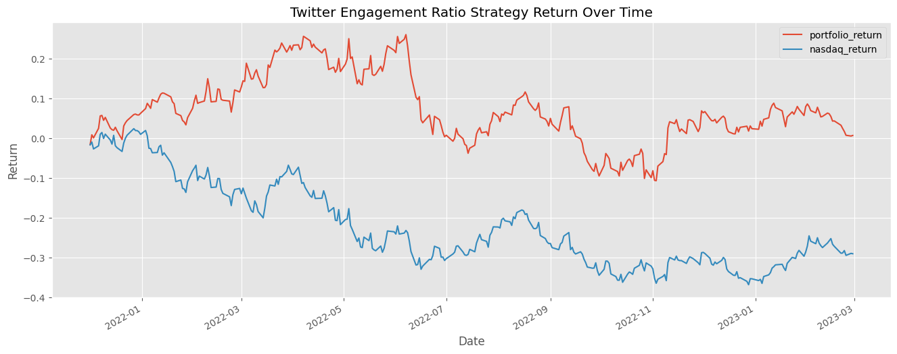

# Quantitative-Trading-Using-Twitter-Sentiment-Analysis

This repository contains a project that showcases a quantitative investment strategy based on sentiment analysis of Twitter data. The goal of this project is to demonstrate how data science techniques can be applied to investment strategies, highlighting the potential utility of social media sentiment in financial decision-making.

The process involves the following steps:

 

<ol>
  <li>Data Collection:</li>
  <ul>
    <li>Collecting a large dataset of tweets related to various stocks.</li>
    <li>The dataset selected was already prepared with the sentiment analysys done</li>
  </ul>

   
  
  <li>Stock Selection:</li>
  <ul>
    <li>Define metrics to create an engagement_ratio rank.</li>
    <li>Ranking the stocks based on their engagement_ratio scores.</li>
  </ul>

    
   
  <li>Investment Strategy:</li>
  <ul>
    <li>The Strategy consist in buy the top 5 stocks in the engagement_ratio rank at the start of each month, rebalancing the portfolio monthly by buying the new top 5 stocks.</li>
  </ul>
</ol>

<h2>Results</h2>

The project demonstrates a systematic approach to integrating social media sentiment into an investment strategy. The performance of the strategy can be visualized through backtesting results in the image below, comparing it against a benchmark index (NASDAQ/QQQ) to evaluate its effectiveness.

<h2>Disclaimer</h2>
This project is purely educational and is not intended as financial advice. The strategy presented here should not be considered a recommendation to buy or sell any securities. Investing in the stock market involves risks, and it is essential to conduct thorough research or consult with a financial advisor before making any investment decision
